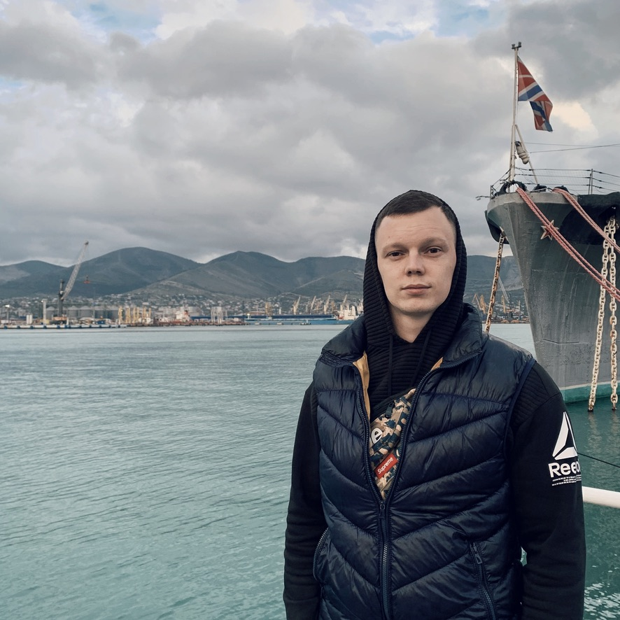

# Привет, меня зовут Данил и я программист. Это моя страница на GitHub

Я закончил АлтГТУ им И.И.Ползунова. Учился на факультете ФИТ. Сначала обучился по специальности ИВТ на уровне бакалавр, 
а затем продолжил обучение по специальности ИВТ и получил степень магистр. Продолжаю развиваться и повышать свою 
квалификацию, посещая различные курсы по углублению своих профессиональных знаний. На данный момент вектор развития 
задан на безопасность в IT. На данный момент имею диплом о профессиональной переподготовке по направлению 
"Информационная безопасность". А так же курсы повышения квалификации по "Сертификация программного обеспечения по
требованиям безопасности информации". 

Мои навыки в мире программирования:
* Опыт работы по разработке на 8 ЯП
* * C++
* * C#
* * C
* * JavaScript
* * SQL
* * PHP
* * Assembler
* * Python
* Сейчас я работаю в лаборатории по поиску программных закладок и уязвимостей в программном обеспечении.
* Основные программы, которые использую в работе PyCharm, DataGrip, PhpStorm, Xcode, WebStorm, OWASP and other
* Имею опыт создания сайтов различной сложности, написания декстопных приложений, работы с микроконтроллерами.

